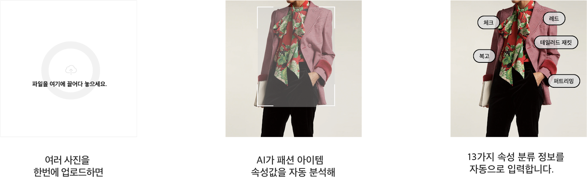

# 옴니어스 스튜디오 개요

### **패션 이미지 분류, 이제 AI가 도와드립니다.**

옴니어스 스튜디오\(이하 스튜디오\)는 패션 실무자들의 업무 효율을 높이는 인공지능 서비스입니다. 패션 이미지를 업로드하면 아이템 속성 정보가 자동 입력되는 스튜디오로 간편하게 이미지를 정리하세요. 실시간 수집되는 SNS 패션 이미지로 트렌드 정보를 분석한 위클리 트렌드는 디자이너, 마케터, MD 모두에게 필요한 정보를 제공합니다.

\*\*\*\*

**1. 관리하기 힘든 아이템 속성 정보를 AI가 자동 입력해 줍니다.** 

스튜디오는 AI가 이미지 속 아이템을 인식하여 카테고리, 아이템뿐 아니라 프린트, 소재감, 디테일, 스타일, 색상 등 세부적인 속성을 분류하고 텍스트 형태의 태그 데이터로 제공합니다. AI가 제공하는 속성 정보는 상품 카탈로그 분석, 경쟁사 상품 분석, 쇼핑몰의 상품 속성 정보 입력 등에 다양하게 활용할 수 있습니다.   
\* 현재 한국어, 영어, 일본어, 중국어로 속성 정보를 제공합니다.  

**2. 원하는 이미지를 손쉽게 찾고 간편하게 공유할 수 있습니다.** 

AI가 인식한 아이템 속성 태그를 검색 키워드로 활용해 필요한 이미지를 쉽게 찾을 수 있습니다. 속성별로 이미지를 모아보는 것도 가능합니다. 동료들과 메신저, 엑셀로 정리하던 아이템 정보도 스튜디오 한곳에 업로드해 실시간 협업도 가능합니다.

